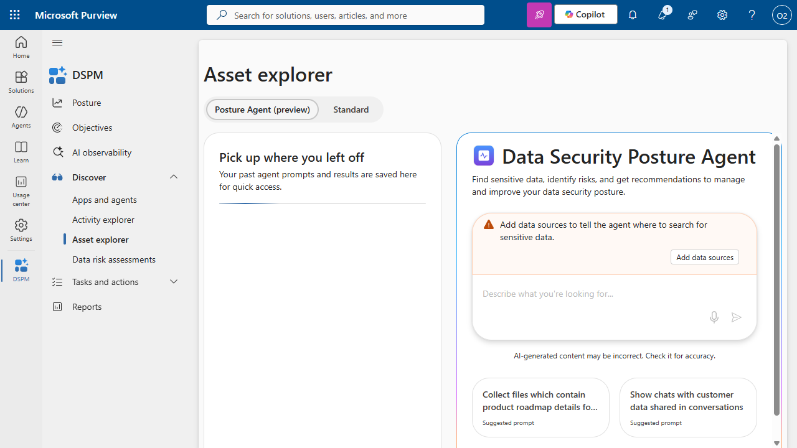

# DSPM Status Report - Batch1

Generated: 2026-05-24 22:19:36

| Status | Count |
|--------|-------|
| COMPLETED | 4 |
| RUNNING | 6 |
| NOT_FOUND | 0 |
| ERROR | 0 |
| **TOTAL** | **10** |

---

## odl_user_2226956@otuwacne103893.onmicrosoft.com

- **Status:** COMPLETED
- **Tenant ID:** ec56821f-5f6d-4b2a-9a3c-b7029424139d
- **Checked at:** 2026-05-24 22:05:51
- **Items:** The Discovery agent found 82 items relevant to Sensitive Data Source Discovery.
- **Date:** 5/23/2026, 5:29 PM

---

## odl_user_2226957@otuwacne103894.onmicrosoft.com

- **Status:** COMPLETED
- **Tenant ID:** a921d03c-fbb5-4129-ae00-6d3e6fcf81a7
- **Checked at:** 2026-05-24 22:06:52
- **Items:** The Discovery agent found 80 items relevant to Sensitive Data Source Discovery.
- **Date:** 5/20/2026, 4:41 PM

---

## odl_user_2226963@otuwacne103895.onmicrosoft.com

- **Status:** COMPLETED
- **Tenant ID:** cc624eac-476b-49bf-9559-7225de43850f
- **Checked at:** 2026-05-24 22:06:55
- **Items:** The Discovery agent found 86 items relevant to Sensitive Data Source Discovery.
- **Date:** 5/20/2026, 2:06 PM

---

## odl_user_2226964@otuwacne103896.onmicrosoft.com

- **Status:** COMPLETED
- **Tenant ID:** 29ad9ccc-95e3-4228-8379-605b6b8e5e12
- **Checked at:** 2026-05-24 22:07:11
- **Job:** Sensitive Password And Credential Files
- **Items:** The Discovery agent found 0 items relevant to Sensitive Password And Credential Files.
- **Date:** 5/23/2026, 5:33 PM

---

## odl_user_2226954@otuwacne103891.onmicrosoft.com

- **Status:** RUNNING
- **Tenant ID:** 238850da-67d5-41ec-8b3a-1a4bbc3598f9
- **Checked at:** 2026-05-24 22:05:51

---

## odl_user_2227227@otuwacne103892.onmicrosoft.com

- **Status:** RUNNING
- **Tenant ID:** 3ac2ca41-8797-40fa-8aad-cf541dc22fa1
- **Checked at:** 2026-05-24 22:05:51

---

## odl_user_2227228@otuwacne103897.onmicrosoft.com

- **Status:** RUNNING
- **Tenant ID:** 5235136c-0b5b-4ea2-ad36-eb0283192b13
- **Checked at:** 2026-05-24 22:08:27

---

## odl_user_2226966@otuwacne103898.onmicrosoft.com

- **Status:** RUNNING
- **Tenant ID:** 2532cb95-80a3-4fa3-b555-295437d451cd
- **Checked at:** 2026-05-24 22:08:41

---

## odl_user_2227229@otuwacne103900.onmicrosoft.com

- **Status:** RUNNING
- **Tenant ID:** e4a6773c-7631-47e7-bd97-a9c6a07470fc
- **Checked at:** 2026-05-24 22:09:53

---

## odl_user_2226967@otuwacne103899.onmicrosoft.com

- **Status:** RUNNING
- **Tenant ID:** 9fd076b2-76ad-4b6f-85d2-6cc8afbd810c
- **Checked at:** 2026-05-24 22:08:45

---

