# DSPM Status Report - Batch2

Generated: 2026-05-24 23:16:13

| Status | Count |
|--------|-------|
| COMPLETED | 9 |
| RUNNING | 39 |
| NOT_FOUND | 6 |
| ERROR | 0 |
| **TOTAL** | **54** |

---

## odl_user_2227034@otuwacne103945.onmicrosoft.com

- **Status:** COMPLETED
- **Tenant ID:** 65b6c862-abe8-4775-bf1b-f04512114af1
- **Checked at:** 2026-05-24 22:58:39
- **Items:** The Discovery agent found 29 items relevant to Sensitive Password And Credentials Files.
- **Date:** 5/24/2026, 10:59 AM

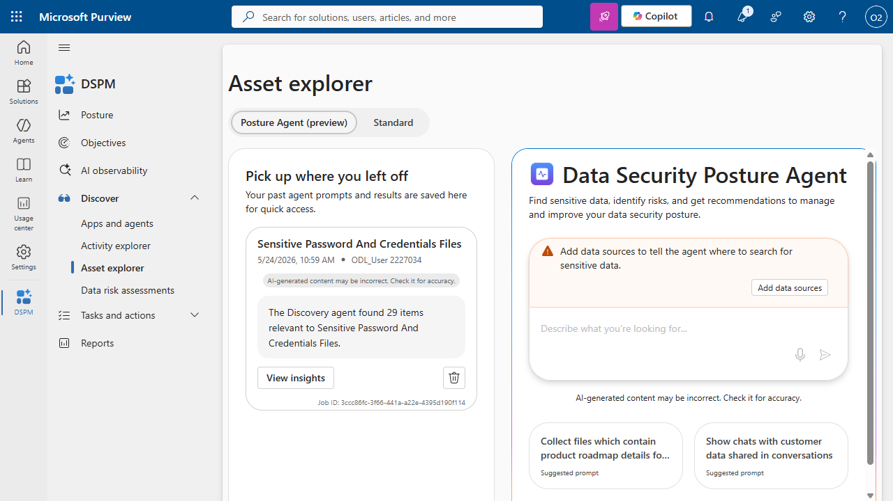

---

## odl_user_2227041@otuwacne103955.onmicrosoft.com

- **Status:** COMPLETED
- **Tenant ID:** d9baa514-5975-4392-b08f-664d3c0fea6f
- **Checked at:** 2026-05-23 18:49:55
- **Job:** Sensitive Password And Credential Files
- **Items:** The Discovery agent found 97 items relevant to Password And Credential File Discovery.
- **Date:** 5/23/2026, 12:22 AM

*No screenshot available*

---

## odl_user_2227239@otuwacne103958.onmicrosoft.com

- **Status:** COMPLETED
- **Tenant ID:** 39cc44fb-7d6d-477a-9d3e-8d297b8b7b27
- **Checked at:** 2026-05-23 18:50:06
- **Items:** The Discovery agent found 86 items relevant to Sensitive Data Source Discovery.
- **Date:** 5/20/2026, 2:58 PM

*No screenshot available*

---

## odl_user_2227049@otuwacne103966.onmicrosoft.com

- **Status:** COMPLETED
- **Tenant ID:** d87bdccf-295a-4082-bec6-1f9fe0657f8d
- **Checked at:** 2026-05-24 23:03:34
- **Items:** The Discovery agent found 76 items relevant to Sensitive Data Source Discovery.
- **Date:** 5/20/2026, 4:21 PM

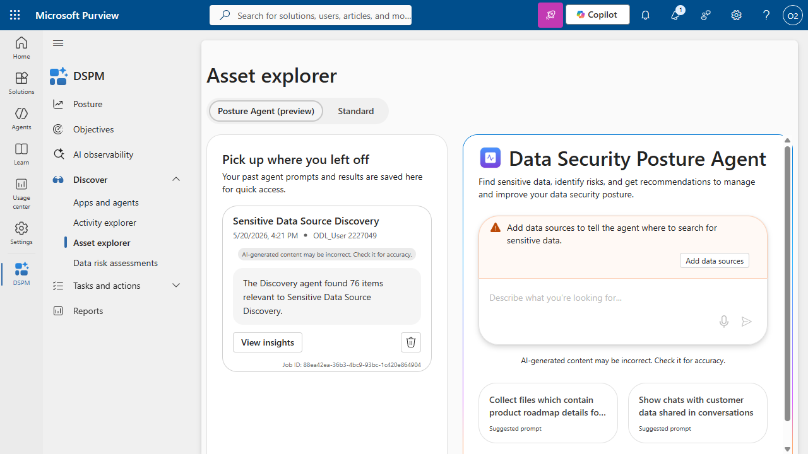

---

## odl_user_2227050@otuwacne103967.onmicrosoft.com

- **Status:** COMPLETED
- **Tenant ID:** d9a9476e-6d10-4d51-a667-f430c40a6db8
- **Checked at:** 2026-05-24 23:03:39
- **Items:** The Discovery agent found 81 items relevant to Sensitive Data Source Discovery.
- **Date:** 5/20/2026, 4:17 PM

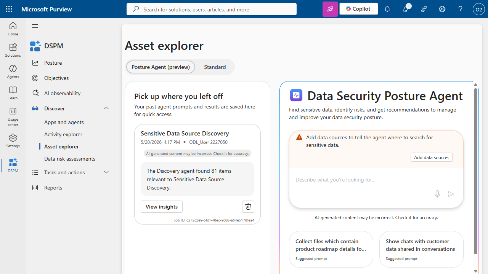

---

## odl_user_2227051@otuwacne103968.onmicrosoft.com

- **Status:** COMPLETED
- **Tenant ID:** 088d64d3-fcc4-428f-bdc6-245bb6227182
- **Checked at:** 2026-05-24 23:04:33
- **Items:** The Discovery agent found 84 items relevant to Sensitive Data Source Discovery.
- **Date:** 5/20/2026, 4:14 PM

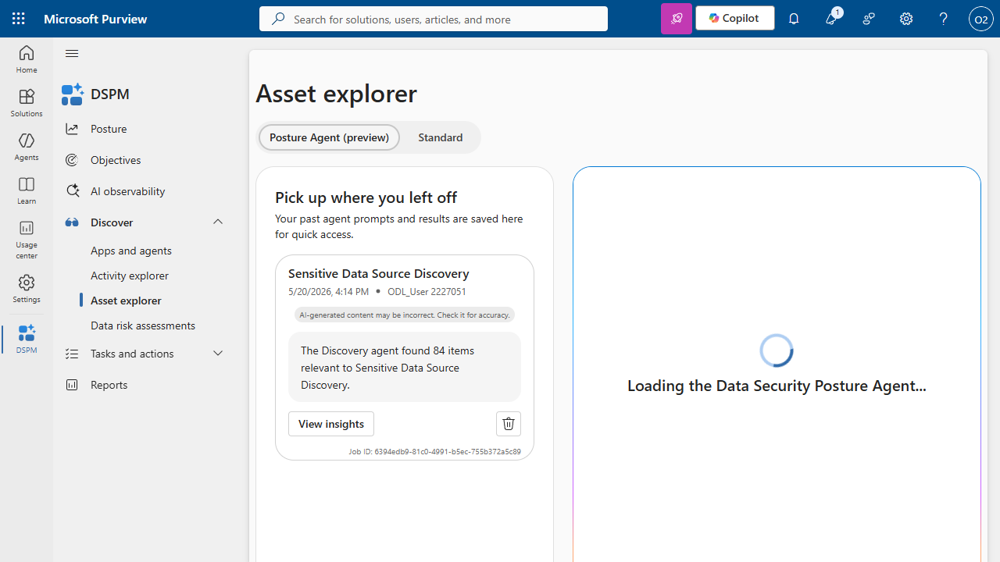

---

## odl_user_2227052@otuwacne103969.onmicrosoft.com

- **Status:** COMPLETED
- **Tenant ID:** 581fb582-2f14-4377-9557-ceea0d409c08
- **Checked at:** 2026-05-24 23:04:35
- **Items:** The Discovery agent found 80 items relevant to Sensitive Data Source Discovery.
- **Date:** 5/20/2026, 4:12 PM

---

## odl_user_2227066@otuwacne103984.onmicrosoft.com

- **Status:** COMPLETED
- **Tenant ID:** 720321f9-abf7-4f35-b95f-865ea1129e66
- **Checked at:** 2026-05-24 23:08:51
- **Items:** The Discovery agent found 0 items relevant to Sensitive Password Credential File Discovery.
- **Date:** 5/24/2026, 2:52 PM

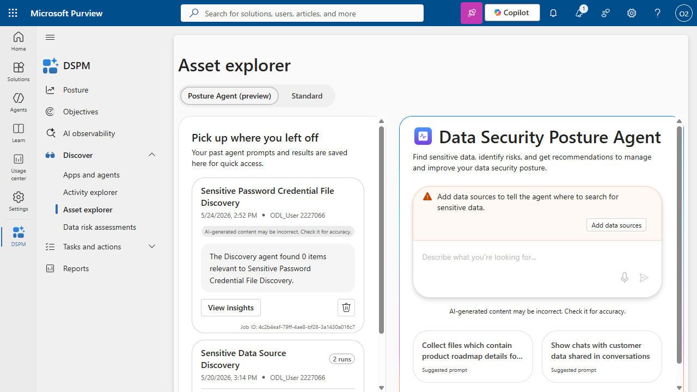

---

## odl_user_2227067@otuwacne103985.onmicrosoft.com

- **Status:** COMPLETED
- **Tenant ID:** 1c7c5c7f-8a07-43d2-a34b-018e9dccf1b5
- **Checked at:** 2026-05-24 23:09:18
- **Job:** Sensitive Password And Credential Files
- **Items:** The Discovery agent found 29 items relevant to Sensitive Password And Credential Files.
- **Date:** 5/24/2026, 2:53 PM

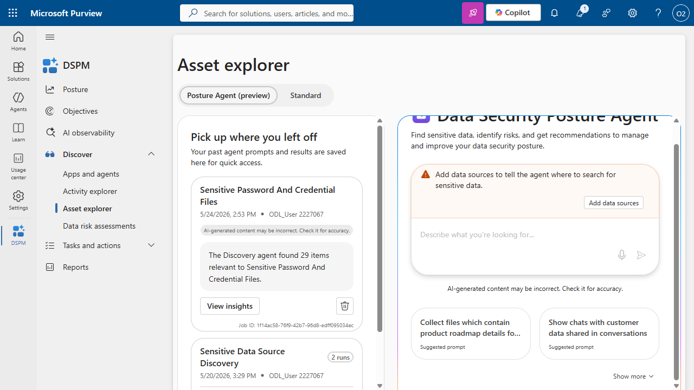

---

## odl_user_2227039@otuwacne103953.onmicrosoft.com

- **Status:** NOT_FOUND
- **Tenant ID:** cbbe8e31-df15-4f69-8758-49dd3fc41410
- **Checked at:** 2026-05-24 23:00:10

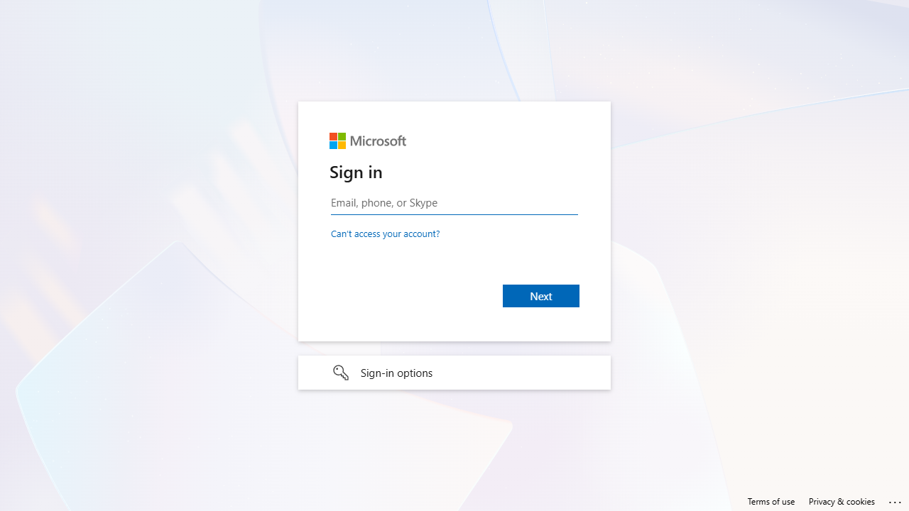

---

## odl_user_2227043@otuwacne103961.onmicrosoft.com

- **Status:** NOT_FOUND
- **Tenant ID:** c373a689-4210-43eb-8365-62ceacf3c2d7
- **Checked at:** 2026-05-24 23:02:10

---

## odl_user_2227242@otuwacne103974.onmicrosoft.com

- **Status:** NOT_FOUND
- **Tenant ID:** b784a8bb-38ad-4d23-91dc-6fa18f32aaf1
- **Checked at:** 2026-05-24 23:06:38

---

## odl_user_2227059@otuwacne103978.onmicrosoft.com

- **Status:** NOT_FOUND
- **Tenant ID:** 996de039-3941-4d35-8d36-c1019a0c004e
- **Checked at:** 2026-05-24 23:07:25

---

## odl_user_2227844@otuwacne103982.onmicrosoft.com

- **Status:** NOT_FOUND
- **Tenant ID:** 7545508a-37a3-4323-a237-a1163e932970
- **Checked at:** 2026-05-24 23:08:29

---

## odl_user_2227845@otuwacne103991.onmicrosoft.com

- **Status:** NOT_FOUND
- **Tenant ID:** 13f4c7f8-6a94-417d-b9f1-5279cc5477a6
- **Checked at:** 2026-05-24 23:11:48

---

## odl_user_2227035@otuwacne103948.onmicrosoft.com

- **Status:** RUNNING
- **Tenant ID:** df7d81ec-95e7-47d4-9ed0-0d73ab04e3d0
- **Checked at:** 2026-05-24 22:58:39

---

## odl_user_2227036@otuwacne103949.onmicrosoft.com

- **Status:** RUNNING
- **Tenant ID:** b1ed5703-8bd0-4f81-ae98-ec3ef7c10c27
- **Checked at:** 2026-05-24 22:58:39

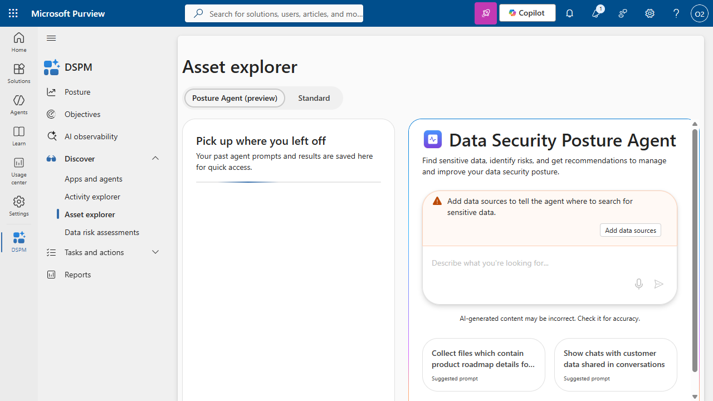

---

## odl_user_2227234@otuwacne103946.onmicrosoft.com

- **Status:** RUNNING
- **Tenant ID:** ce2d853e-7aa7-4c09-9d3c-3ba7db826653
- **Checked at:** 2026-05-24 22:58:39

---

## odl_user_2227235@otuwacne103947.onmicrosoft.com

- **Status:** RUNNING
- **Tenant ID:** 76b4a96c-05d0-488d-9d65-d2f2c903dff6
- **Checked at:** 2026-05-24 22:58:39

---

## odl_user_2227038@otuwacne103952.onmicrosoft.com

- **Status:** RUNNING
- **Tenant ID:** 55fdf1aa-ad94-4198-ac1b-68717a4a8fc5
- **Checked at:** 2026-05-24 23:00:10

---

## odl_user_2227037@otuwacne103951.onmicrosoft.com

- **Status:** RUNNING
- **Tenant ID:** b61fd3b5-554d-4e28-8601-ed0dac162077
- **Checked at:** 2026-05-24 23:00:03

---

## odl_user_2227236@otuwacne103950.onmicrosoft.com

- **Status:** RUNNING
- **Tenant ID:** 2c3790df-5ea3-4041-beae-f56d674c9dc6
- **Checked at:** 2026-05-24 23:00:00

---

## odl_user_2227040@otuwacne103954.onmicrosoft.com

- **Status:** RUNNING
- **Tenant ID:** 7bfbd78a-45a0-4671-a309-c4fb32d5bc5a
- **Checked at:** 2026-05-24 23:00:12

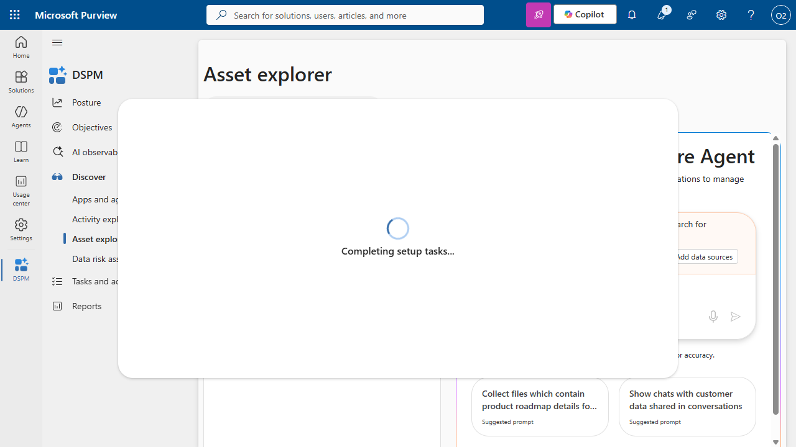

---

## odl_user_2227237@otuwacne103956.onmicrosoft.com

- **Status:** RUNNING
- **Tenant ID:** 265daf79-065a-4b05-8cff-f07a9c200303
- **Checked at:** 2026-05-24 23:01:07

---

## odl_user_2227238@otuwacne103957.onmicrosoft.com

- **Status:** RUNNING
- **Tenant ID:** a62bd3b3-81da-4d05-849f-7aa531392d00
- **Checked at:** 2026-05-24 23:01:09

---

## odl_user_2227240@otuwacne103960.onmicrosoft.com

- **Status:** RUNNING
- **Tenant ID:** d3e105f7-469f-424d-8951-c83ac7cf597d
- **Checked at:** 2026-05-24 23:01:32

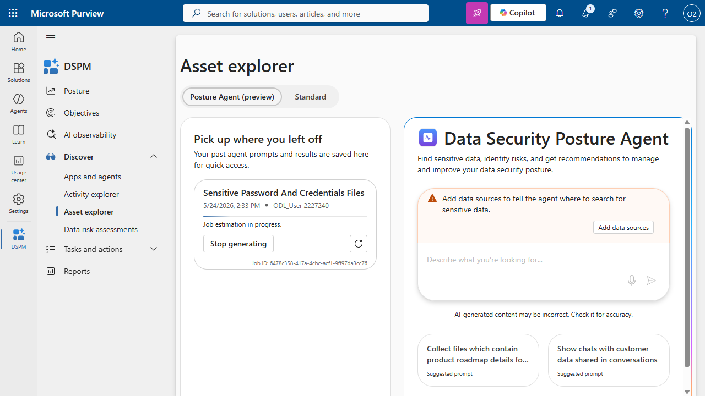

---

## odl_user_2227045@otuwacne103963.onmicrosoft.com

- **Status:** RUNNING
- **Tenant ID:** 0b23844d-215b-466f-8100-b03bbb5f3911
- **Checked at:** 2026-05-24 23:02:26

---

## odl_user_2227044@otuwacne103962.onmicrosoft.com

- **Status:** RUNNING
- **Tenant ID:** 152c40d7-5a3a-4f32-af08-57fcc2287489
- **Checked at:** 2026-05-24 23:02:16

---

## odl_user_2227042@otuwacne103959.onmicrosoft.com

- **Status:** RUNNING
- **Tenant ID:** 360ebf92-46dc-4d94-9c5b-2716e53460fc
- **Checked at:** 2026-05-24 23:01:12

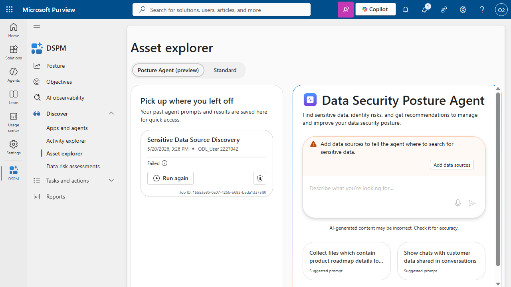

---

## odl_user_2227046@otuwacne103964.onmicrosoft.com

- **Status:** RUNNING
- **Tenant ID:** bc496fd4-cbca-43f9-a157-682f299c41c2
- **Checked at:** 2026-05-24 23:02:32

---

## odl_user_2227047@otuwacne103965.onmicrosoft.com

- **Status:** RUNNING
- **Tenant ID:** e5fa521c-34f2-451c-93ab-e275aa237515
- **Checked at:** 2026-05-24 23:03:33

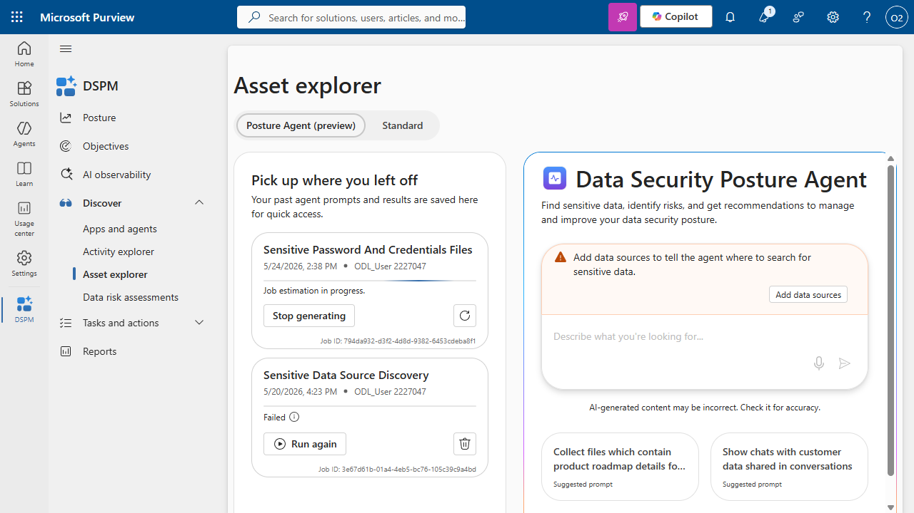

---

## odl_user_2227053@otuwacne103970.onmicrosoft.com

- **Status:** RUNNING
- **Tenant ID:** 5260b566-f122-49c9-99ab-7916003b0980
- **Checked at:** 2026-05-24 23:04:39

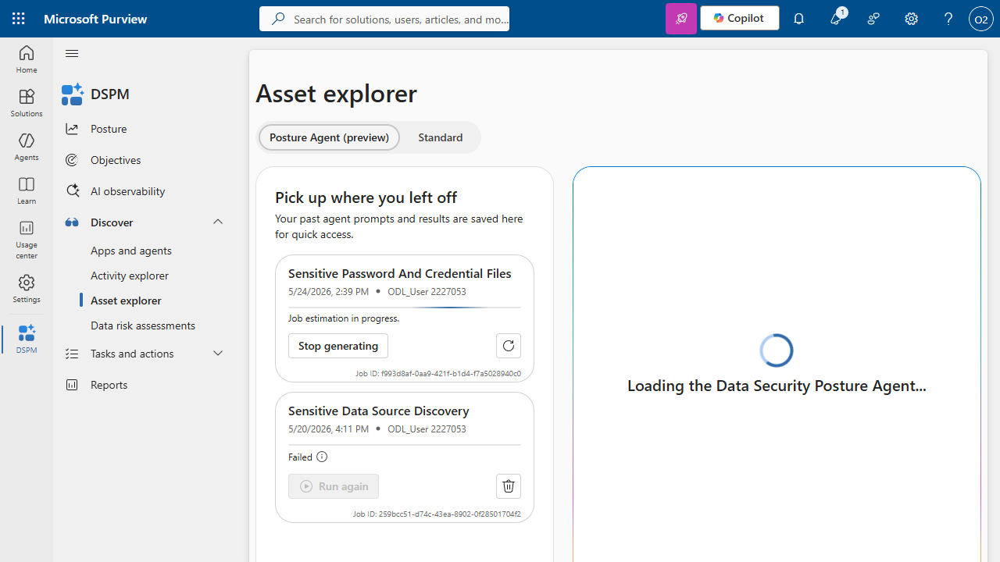

---

## odl_user_2227241@otuwacne103971.onmicrosoft.com

- **Status:** RUNNING
- **Tenant ID:** ac3439e7-a87c-4d49-9ce6-e160f843b335
- **Checked at:** 2026-05-24 23:05:27

---

## odl_user_2227054@otuwacne103972.onmicrosoft.com

- **Status:** RUNNING
- **Tenant ID:** c00a3fea-3972-4c63-a250-22a96d8af04d
- **Checked at:** 2026-05-24 23:05:36

---

## odl_user_2227055@otuwacne103973.onmicrosoft.com

- **Status:** RUNNING
- **Tenant ID:** 8397a0cc-e938-47e8-8eb6-10d147fa7c9a
- **Checked at:** 2026-05-24 23:05:40

---

## odl_user_2227057@otuwacne103976.onmicrosoft.com

- **Status:** RUNNING
- **Tenant ID:** 62ee6aee-b2fe-49e5-bf86-99d42ea82bcb
- **Checked at:** 2026-05-24 23:06:44

---

## odl_user_2227056@otuwacne103975.onmicrosoft.com

- **Status:** RUNNING
- **Tenant ID:** bebe3aa5-8e16-452a-83bb-be5947d6f98c
- **Checked at:** 2026-05-24 23:06:44

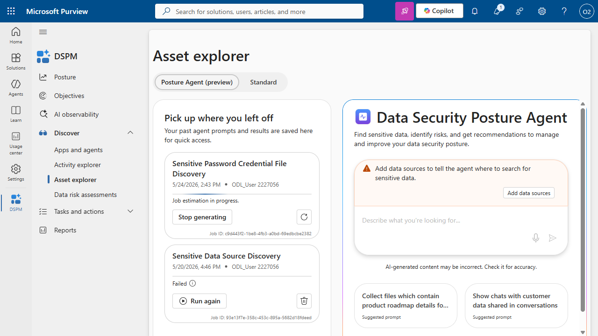

---

## odl_user_2227243@otuwacne103977.onmicrosoft.com

- **Status:** RUNNING
- **Tenant ID:** 3a6c6a6f-0ec1-41d3-ae2f-6c8619ccca0f
- **Checked at:** 2026-05-24 23:07:05

---

## odl_user_2227060@otuwacne103979.onmicrosoft.com

- **Status:** RUNNING
- **Tenant ID:** 5d6cad3a-51ac-4226-9127-86b1f2fd974f
- **Checked at:** 2026-05-24 23:07:43

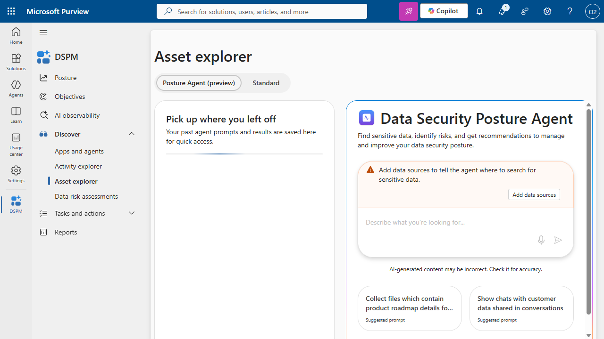

---

## odl_user_2227061@otuwacne103980.onmicrosoft.com

- **Status:** RUNNING
- **Tenant ID:** d0a39780-539a-4a6e-b2de-b736b0620bbf
- **Checked at:** 2026-05-24 23:07:48

---

## odl_user_2227063@otuwacne103981.onmicrosoft.com

- **Status:** RUNNING
- **Tenant ID:** ee874972-3931-442f-94f1-194077ab5509
- **Checked at:** 2026-05-24 23:08:04

---

## odl_user_2227065@otuwacne103983.onmicrosoft.com

- **Status:** RUNNING
- **Tenant ID:** 6c747e2a-2cfa-4353-83c2-2f96e8658e7f
- **Checked at:** 2026-05-24 23:08:48

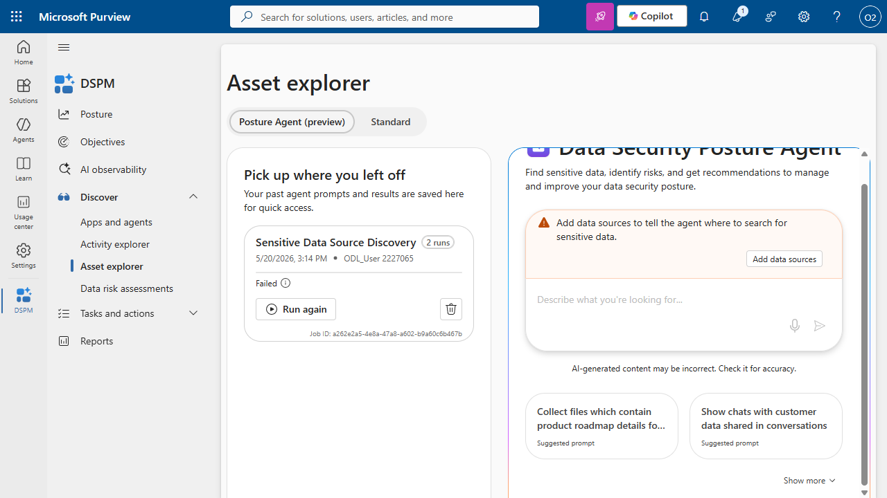

---

## odl_user_2227070@otuwacne103987.onmicrosoft.com

- **Status:** RUNNING
- **Tenant ID:** d10bb18b-1445-4d3c-9013-b6816b01a14d
- **Checked at:** 2026-05-24 23:09:54

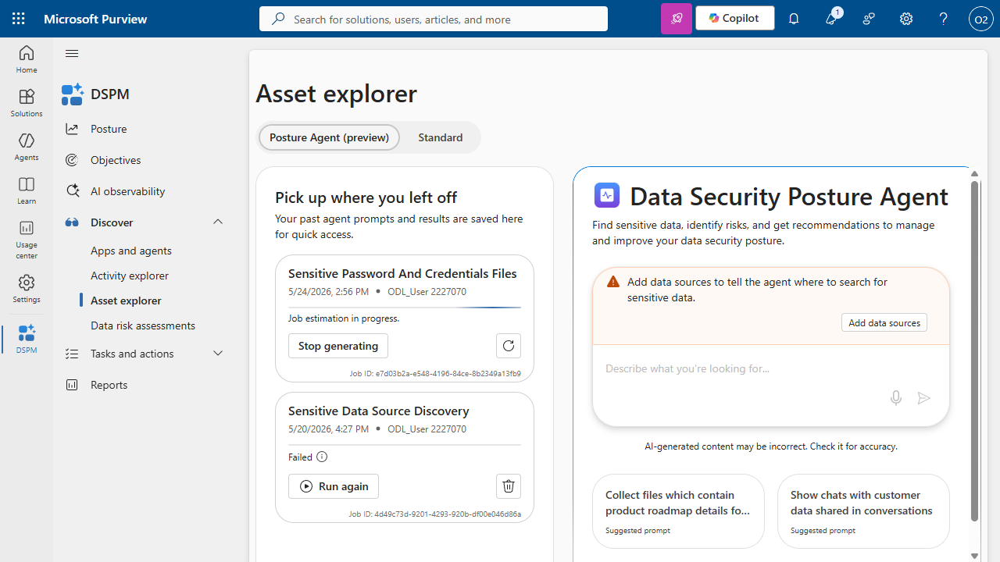

---

## odl_user_2227068@otuwacne103986.onmicrosoft.com

- **Status:** RUNNING
- **Tenant ID:** 2f2346f5-7774-44af-bff8-48424e5098a4
- **Checked at:** 2026-05-24 23:09:38

---

## odl_user_2227244@otuwacne103989.onmicrosoft.com

- **Status:** RUNNING
- **Tenant ID:** 7b89fd47-443d-426c-a9c3-ae01ee45bd46
- **Checked at:** 2026-05-24 23:10:50

---

## odl_user_2227072@otuwacne103990.onmicrosoft.com

- **Status:** RUNNING
- **Tenant ID:** 0fdff097-6981-49aa-a15d-b300e7a85553
- **Checked at:** 2026-05-24 23:10:56

---

## odl_user_2227071@otuwacne103988.onmicrosoft.com

- **Status:** RUNNING
- **Tenant ID:** 6ad8c3d0-d2a5-4679-886a-62520920bc6b
- **Checked at:** 2026-05-24 23:10:49

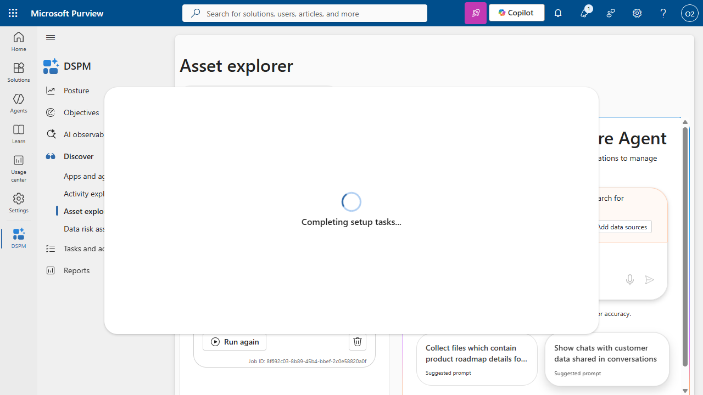

---

## odl_user_2227075@otuwacne103993.onmicrosoft.com

- **Status:** RUNNING
- **Tenant ID:** 515758fa-6df2-4d1c-ad7f-c6e92e29cd5a
- **Checked at:** 2026-05-24 23:11:58

---

## odl_user_2227074@otuwacne103992.onmicrosoft.com

- **Status:** RUNNING
- **Tenant ID:** d180178c-b0a7-4b4f-a760-c17d5432a050
- **Checked at:** 2026-05-24 23:11:56

---

## odl_user_2227076@otuwacne103994.onmicrosoft.com

- **Status:** RUNNING
- **Tenant ID:** 9497f345-2dc9-4aca-9581-03f973c0729b
- **Checked at:** 2026-05-24 23:12:51

---

## odl_user_2227077@otuwacne103995.onmicrosoft.com

- **Status:** RUNNING
- **Tenant ID:** 4b2446e0-e17b-4e53-92dc-27c96dbf052b
- **Checked at:** 2026-05-24 23:12:57

---

## odl_user_2227078@otuwacne103996.onmicrosoft.com

- **Status:** RUNNING
- **Tenant ID:** ecc2d30e-95b3-41ef-b4b1-2f9f541a34ca
- **Checked at:** 2026-05-24 23:13:07

---

## odl_user_2227079@otuwacne103997.onmicrosoft.com

- **Status:** RUNNING
- **Tenant ID:** a72d2241-6280-47be-a855-ea92aaf08ed6
- **Checked at:** 2026-05-24 23:13:16

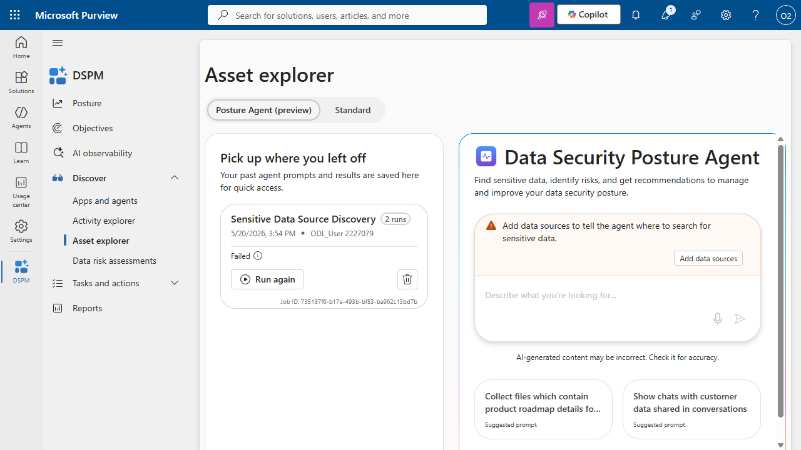

---

## odl_user_2227080@otuwacne103998.onmicrosoft.com

- **Status:** RUNNING
- **Tenant ID:** 3ed144d1-0d90-40cb-9bb4-dbad7a874e74
- **Checked at:** 2026-05-24 23:13:49

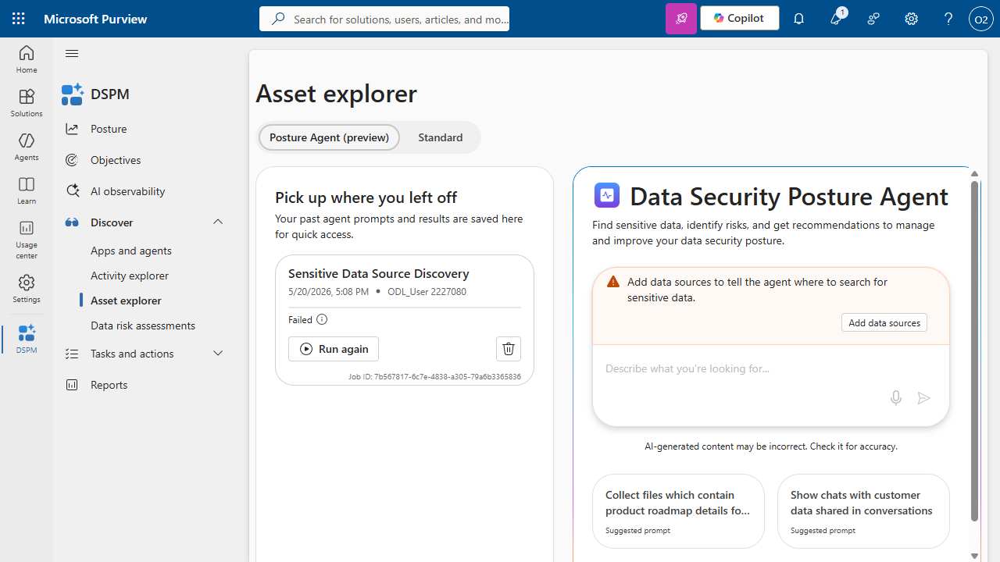

---

